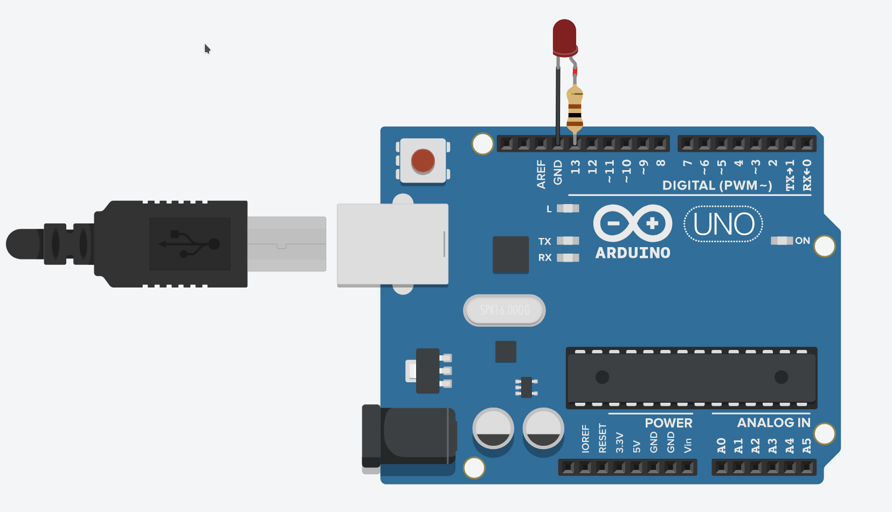
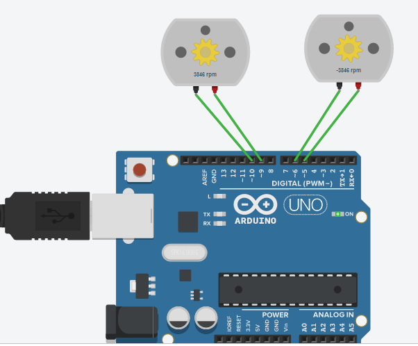
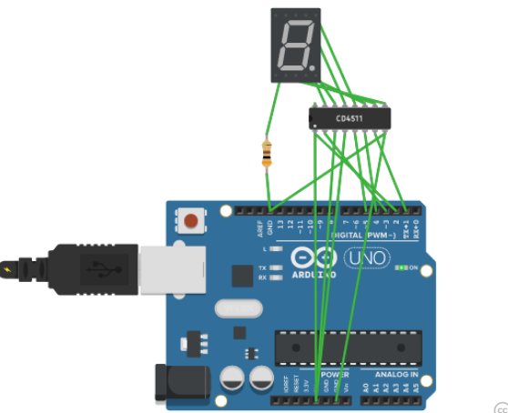

# 国际双创实践周 - 开源硬件实战 - 刘尧

## 一. 国际双创实践周参与情况

### 第一天

介绍了 Arduino 硬件, 创客思想

介绍了 Arduino IDE, Processing , fritzing

介绍了 Github


作业:

安装三个软件

注册GitHub 建立仓库用于提交编程作业

### 第二天

讲解了Arduino 基础编程, 串口编程

作业:

在Arduino上完成, 从电脑串口接收一串字符, 使用LED 发送对应的Morse码





### 第三天

介绍了Arduino仿真网站 Tinkercad

讲解了电机的使用, PWM技术

讲解了7段数码管编程, CD4511使用

作业:

在Arduino上完成

给课堂例子增加转向灯功能


```c++
void setup()
{
  pinMode(5, OUTPUT);
  pinMode(6, OUTPUT);
  pinMode(9, OUTPUT);
  pinMode(10, OUTPUT);
  Serial.begin(9600);    
}

int income;

void loop()
{
  if(Serial.available()>0)
{
    income=Serial.read();
  }
  switch(income)
  {
    case 'f':
    	forward();
    break;
    case 'b':
    	backward();
    break;
    case 'l':
    	left();
    break;
    case 'r':
    	right();
    break;
    case 's':
    	stop();
    defauit:break;
  }
}
  
  
void forward() {
    digitalWrite(5,HIGH);
    digitalWrite(6,LOW);
    digitalWrite(9,HIGH);
    digitalWrite(10,LOW);
  }
  
void backward() {
    digitalWrite(6,HIGH);
    digitalWrite(5,LOW);
    digitalWrite(10,HIGH);
    digitalWrite(9,LOW);
  }  
  
void left() {
    digitalWrite(5,HIGH);
    digitalWrite(6,LOW);
    digitalWrite(10,HIGH);
    digitalWrite(9,LOW);
  }  
  
void right() {
    digitalWrite(6,HIGH);
    digitalWrite(5,LOW);
    digitalWrite(9,HIGH);
    digitalWrite(10,LOW);
  }  
  
void stop() {
    digitalWrite(5,LOW);
    digitalWrite(6,LOW);
    digitalWrite(9,LOW);
    digitalWrite(10,LOW);
  } 
```

通过串口输入数字, 在数码管显示



```c++
void setup()
{
  pinMode(1, OUTPUT);
  pinMode(2, OUTPUT);
  pinMode(3, OUTPUT);
  pinMode(4, OUTPUT);
  pinMode(5, OUTPUT);
  Serial.begin(9600);
}
int income;

void loop()
{
  if(Serial.available()>0)
{
    income=Serial.read();
  }
  switch(income)
  {
    case '0':
    	out0();
    break;
        case '1':
    	out1();
    break;
        case '2':
    	out2();
    break;
        case '3':
    	out3();
    break;
        case '4':
    	out4();
    break;
        case '5':
    	out5();
    break;
        case '6':
    	out6();
    break;
        case '7':
    	out7();
    break;
        case '8':
    	out8();
    break;
        case '9':
    	out9();
    break;
    defauit:break;
  }
}
void out0()
{
  digitalWrite(4, LOW);
  delay(10);
  digitalWrite(3, LOW);
  delay(10);
  digitalWrite(2, LOW);
  delay(10);
  digitalWrite(1, LOW);
  delay(10);
  digitalWrite(5, LOW);
  delay(10);
}
void out1()
{
  digitalWrite(4, LOW);
  delay(10);
  digitalWrite(3, LOW);
  delay(10);
  digitalWrite(2, LOW);
  delay(10);
  digitalWrite(1, HIGH);
  delay(10);
  digitalWrite(5, LOW);
  delay(10);
}
void out2()
{
  digitalWrite(4, LOW);
  delay(10);
  digitalWrite(3, LOW);
  delay(10);
  digitalWrite(2, HIGH);
  delay(10);
  digitalWrite(4, LOW);
  delay(10);
  digitalWrite(1, LOW);
  delay(10);
}
void out3()
{
  digitalWrite(4, LOW);
  delay(10);
  digitalWrite(3, LOW);
  delay(10);
  digitalWrite(2, HIGH);
  delay(10);
  digitalWrite(1, HIGH);
  delay(10);
  digitalWrite(5, LOW);
  delay(10);
}
void out4()
{
  digitalWrite(4, LOW);
  delay(10);
  digitalWrite(3, HIGH);
  delay(10);
  digitalWrite(2, LOW);
  delay(10);
  digitalWrite(1, LOW);
  delay(10);
  digitalWrite(5, LOW);
  delay(10);
}
void out5()
{
  digitalWrite(4, LOW);
  delay(10);
  digitalWrite(3, HIGH);
  delay(10);
  digitalWrite(2, LOW);
  delay(10);
  digitalWrite(1, HIGH);
  delay(10);
  digitalWrite(5, LOW);
  delay(10);
}
void out6()
{
  digitalWrite(4, LOW);
  delay(10);
  digitalWrite(3, HIGH);
  delay(10);
  digitalWrite(2, HIGH);
  delay(10);
  digitalWrite(1, LOW);
  delay(10);
  digitalWrite(5, LOW);
  delay(10);
}
void out7()
{
  digitalWrite(4, LOW);
  delay(10);
  digitalWrite(3, HIGH);
  delay(10);
  digitalWrite(2, HIGH);
  delay(10);
  digitalWrite(1, HIGH);
  delay(10);
  digitalWrite(5, LOW);
  delay(10);
}
void out8()
{
  digitalWrite(4, HIGH);
  delay(10);
  digitalWrite(3, LOW);
  delay(10);
  digitalWrite(2, LOW);
  delay(10);
  digitalWrite(1, LOW);
  delay(10);
  digitalWrite(5, LOW);
  delay(10);
}
void out9()
{
  digitalWrite(4, HIGH);
  delay(10);
  digitalWrite(3, LOW);
  delay(10);
  digitalWrite(2, LOW);
  delay(10);
  digitalWrite(1, HIGH);
  delay(10);
  digitalWrite(5, LOW);
  delay(10);
}
```

### 第四天

以仿真方式完善第一天内容

答疑环节

交流和总结

作业:

撰写总结报告

完善Github仓库格式


```c++
#define pin 13
char MORSE[][4] = {
  {'.', '-', '*', '*'}, //A
  {'-', '.', '.', '.'}, //B
  {'-', '.', '-', '.'}, //C
  {'-', '.', '.', '*'}, //D
  {'.', '*', '*', '*'}, //E
  {'.', '.', '-', '.'}, //F
  {'-', '-', '.', '*'}, //G
  {'.', '.', '.', '.'}, //H
  {'.', '.', '*', '*'}, //I
  {'.', '-', '-', '-'}, //J
  {'-', '.', '-', '*'}, //K
  {'.', '-', '.', '.'}, //L
  {'-', '-', '*', '*'}, //M
  {'-', '.', '*', '*'}, //N
  {'-', '-', '-', '*'}, //O
  {'.', '-', '-', '.'}, //P
  {'-', '-', '.', '-'}, //Q
  {'.', '-', '.', '*'}, //R
  {'.', '.', '.', '*'}, //S
  {'-', '*', '*', '*'}, //T
  {'.', '.', '-', '*'}, //U
  {'.', '.', '.', '-'}, //V
  {'.', '-', '-', '*'}, //W
  {'-', '.', '.', '-'}, //X
  {'-', '.', '-', '-'}, //Y
  {'-', '-', '.', '.'}  //Z
};

void dot() {
  digitalWrite(pin, HIGH);
  delay(250);
  digitalWrite(13, LOW);
  delay(250);
}

void dash() {
  digitalWrite(pin, HIGH);
  delay(750);
  digitalWrite(13, LOW);
  delay(250);
}

void c_space() {
  digitalWrite(pin, LOW);
  delay(750);
}

void w_space() {
  digitalWrite(pin, LOW);
  delay(1750);
}

void setup()
{
  pinMode(13, OUTPUT);
  Serial.begin(9600);
}

void loop()
{
  String str = "";
  String morse_s = ""; 
  int i, t , temp = 0;
  int n = 0;
  while (Serial.available() > 0)
  {
    temp = 1;
    str += char(Serial.read());
    delay(2);
    n++;
  }

  if (temp)
  {
    for (i = 0; i < n; i++)
    {
      if (str[i] >= 97 && str[i] <= 122)
      {
        for (t = 0; t < 4; t++)
        {
          morse_s += char(MORSE[int(str[i] - 97)][t]);
        }
      }
      if (int(str[i]) != 32) {
        morse_s += '/';
      } else {
        morse_s += ' ';
      }
    }
    Serial.println(morse_s);
    for (i = 0; morse_s[i] != '\0' ; i++)
    {
      if (morse_s[i] == '.')dot();
      else if (morse_s[i] == '-')dash();
      else if (morse_s[i] == ' ')w_space();
      else if (morse_s[i] == '/')c_space();
    }
    Serial.println("发送完毕");
    delay(2);
  }
}
```

## 二. 国际双创实验周主要收获

学习到了Arduino 的基础入门知识并实际操作了一些代码实验

增加了对开源硬件的兴趣

## 三. 意见与建议

希望每一门双创周课程标明其前置课程

避免没有基础或基础不过关的同学影响教学进度

有很多基础知识并不了解，包括基础的Linux使用， git的使用，数字电路相关内容，

甚至 C++ 的基础 导致许多操作都要老师去现场讲解和实际操作

这极大程度的拖慢了教学进度， 使得课程达不到预期效果
